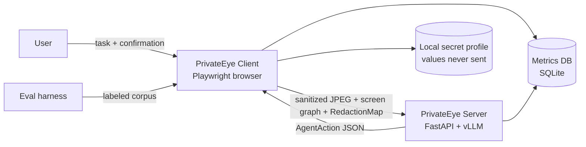
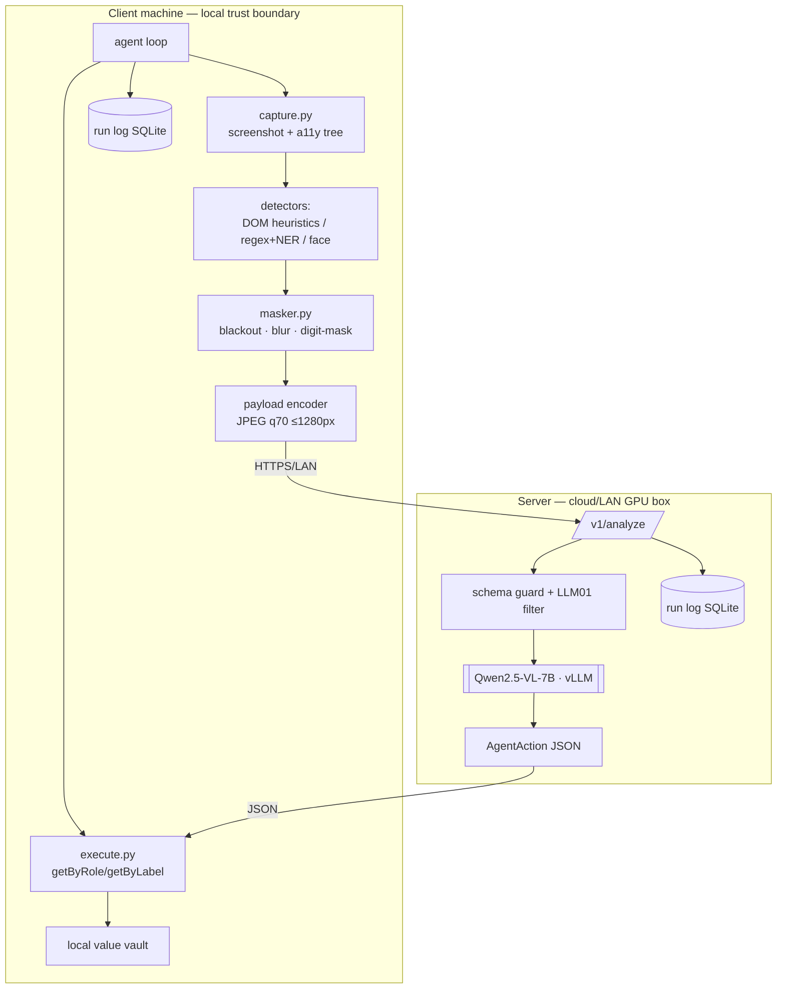
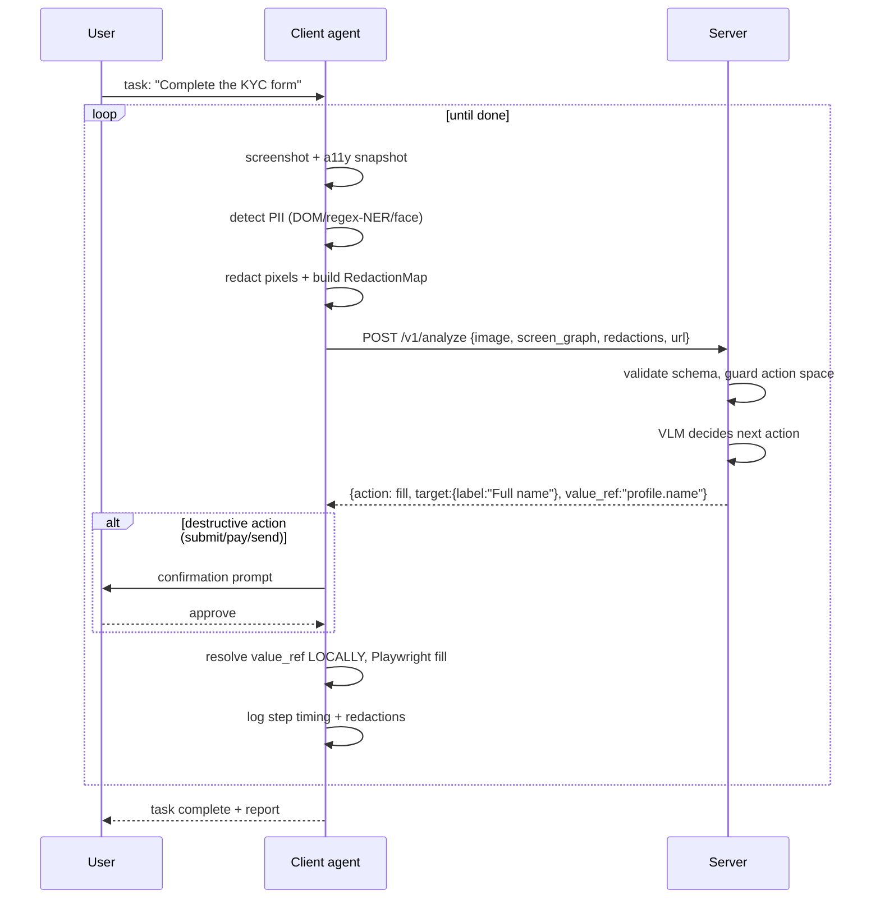

# ARCHITECTURE.md

## System Context

## Container diagram

## Sequence: one step

## Trust boundaries

1. **TB-1 Client↔Server**: only `ScreenContext` may cross. Enforced by: outbound interceptor that runs
   detectors on the *encoded* image and REFUSES to send if any unredacted PII match (defense-in-depth
   beyond the redact step) + static ban on serializing vault values.
2. **TB-2 Vault**: secret profile lives in client memory/env only; value_ref indirection everywhere else.
3. **TB-3 VLM output**: commands pass a whitelist filter (action ∈ enum, target must exist in screen_graph)
   before execution — LLM01 prompt-injection mitigation.

## Failure boundaries

- Client CV failure → skip frame, reuse last valid RedactionMap, alert user.
- Server unreachable → pause loop, queue nothing (no local PII buffering), ask user.
- Action execution failure → retry ≤2 with fresh context → escalate to ask_user (NFR-007).
- VLM emits invalid JSON → one repair retry with schema-error feedback → ask_user.

## Deployment architecture
- Dev: everything on one laptop; server in mock mode (hardcoded actions) so client work isn't GPU-blocked.
- Staging: server on LAN GPU machine (docker compose), client laptop, demo sites container.
- Production (demo): same as staging + dashboard on projector.
- Disaster recovery: run logs are disposable (RPO: none needed); demo sites are stateless containers (RTO: restart).

## Scalability & availability
See SCALABILITY.md. MVP is single-agent by design; horizontal scaling = N stateless vLLM replicas
behind a load balancer when needed (V1+), no architecture change.
