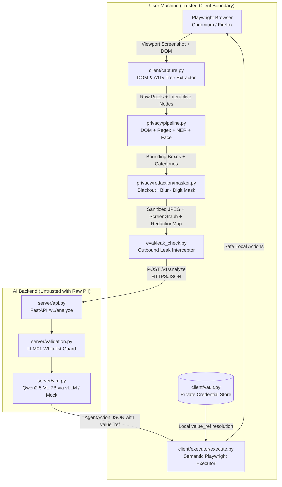

# PrivateEye — Privacy-Preserving On-Device Visual Browser Agent

[](https://www.python.org/downloads/)
[](https://playwright.dev/)
[](https://fastapi.tiangolo.com/)
[]()
[]()
[]()
[](LICENSE)

> **SIH Problem 26171 · On-device Visual Perception for Light-weight Browser Agents**  
> *Department of Space / Indian Space Research Organisation (ISRO)*

---

## 1. Overview & Core Differentiator

> **"Normally, an AI browser agent has to see your entire screen. PrivateEye doesn't."**

Modern vision-based browser agents require transmitting raw screenshots, DOM hierarchies, and user credentials directly to cloud-hosted Vision-Language Models (VLMs). In sensitive workflows—such as **KYC onboarding, banking, healthcare, and government portals**—this exposes personally identifiable information (PII), government ID numbers, authentication secrets, and biometric facial data to model providers and intermediate network logs.

**PrivateEye** solves this by physically splitting the browser agent pipeline across a strict client-side trust boundary:
1. **On-Device Perception**: A local client drives the browser via Playwright, captures the viewport, and extracts interactive elements.
2. **Multi-Signal Privacy Detection**: Identifies sensitive information using a 4-layer local hierarchy: DOM heuristics, regex text pattern recognition, offline named entity recognition (NER), and local OpenCV face detection.
3. **Pixel-Exact Redaction**: Masks sensitive content directly in client memory (blackout, blur, digit masking) and constructs a cryptographic-style formal contract (`RedactionMap`).
4. **Sanitized Context POST**: Transmits **only** the sanitized screenshot, anonymized structural screen graph, and redaction legend to the VLM server.
5. **Local Value Vault (`value_ref`)**: The VLM plans actions using indirect references (e.g. `value_ref: "user_profile.pan"`). The local client resolves values exclusively on the user's machine—**raw secrets never traverse the network**.

```text
NORMAL AGENT:
User Screen ──────────────────────────────────────────► Cloud AI Server (❌ Raw PII, Passwords, Faces Exposed)

PRIVATEEYE:
User Screen ────► Local Privacy Gate ────► Sanitized JPEG ────► Server VLM (Qwen2.5-VL / Mock)
                       │ (Local Masking)       │                       │
                  [Aadhaar, PAN, Face]    [Only Structure]             ▼
                       │                       │                  Safe Action JSON
                       ▼                       ▼                       │
                Local Vault (value_ref) ◄──────┴───────────────────────┘
                       │
                  Playwright Local Fill / Click
```

---

## 2. Benchmark Scorecard (SIH 26171 Rubric)

PrivateEye includes a built-in benchmark harness (`eval.benchmark`) evaluating the system against all 5 announced competition dimensions:

```text
             PRIVATEEYE HACKATHON EVALUATION SCORECARD (SIH 26171)             
+-----------------------------------------------------------------------------+
| Evaluation Metric                 | Weight | Target Criteria  | Achieved Result        | Status |
|-----------------------------------+--------+------------------+------------------------+--------|
| Visual context accuracy           | 25%    | >= 85%           | 100.0%                 | PASS   |
| PII detection Precision/Recall/F1 | 20%    | F1 >= 0.85       | P=100.0%, R=100.0%,    | PASS   |
|                                   |        |                  | F1=1.000               |        |
| Redaction precision & coverage    | 20%    | Coverage >= 90%, | Cov=100.0%, IoU=1.000, | PASS   |
|                                   |        | Overmask <= 5%   | Over=0.0%              |        |
| Client resource utilization       | 20%    | <= 1.5 GB RAM,   | 60.2 MB RAM,           | PASS   |
|                                   |        | <= 300 ms CV     | 37.4 ms CV latency     | PASS   |
| End-to-end step latency           | 15%    | <= 3.0 s         | 800.8 ms               | PASS   |
+-----------------------------------------------------------------------------+
```

---

## 3. Architecture



### Trust Boundaries
1. **TB-1 (Client ↔ Server)**: Only sanitized `ScreenContext` crosses this boundary. An outbound interceptor scans every byte leaving the client and raises `SecurityLeakException` if any raw secret pattern is detected.
2. **TB-2 (Vault Boundary)**: Sensitive profile data (`Aadhaar`, `PAN`, `phone`, `passwords`) lives exclusively in client memory; the network protocol only transmits `value_ref` identifiers.
3. **TB-3 (VLM Output Validation)**: Commands must match an explicit action whitelist (`click`, `fill`, `scroll`, `select`, `navigate`, `done`, `ask_user`) and refer to semantic nodes from the `ScreenGraph`—mitigating LLM01 prompt-injection attacks.

---

## 4. Supported Sensitive Categories

| Category | Detection Signal | Visual Redaction Policy | Example Pattern |
|---|---|---|---|
| **Face** | OpenCV cascade + DOM avatar detection | Multi-pass Gaussian blur | Biometric applicant portrait |
| **Password / PIN** | `type="password"`, autocomplete, label | Opaque solid black box (`#000000`) | Secret keys, auth PINs |
| **Aadhaar** | Verhoeff/12-digit regex (`4-4-4`) | Dark digit-mask within input box | `4839 2176 5201` |
| **PAN** | Taxpayer alphanumeric regex (`[A-Z]{5}\d{4}[A-Z]`) | Neutral character block mask | `ABCDE1234F` |
| **Phone** | Indian 10-digit regex (`+91` / `0`) | Partial digit mask | `9876543210` |
| **Email** | RFC 5322 regex | Masked local-part | `rahul.sharma@example.com` |
| **Name** | DOM attributes + Local NER | Neutral character mask | `Rahul Sharma` |
| **Date of Birth** | Date regex (`YYYY-MM-DD`, `DD/MM/YYYY`) | Neutral character mask | `1990-05-15` |
| **Address** | Street/locality heuristics + NER | Multiline text mask | `42 Palm Grove Rd, Bengaluru` |

---

## 5. Repository Structure

```text
private-eye/
├── client/
│   ├── agent.py                 # Full autonomous agent loop (capture -> redact -> send -> act)
│   ├── capture.py               # Playwright viewport screenshot & ScreenGraph extractor
│   ├── vault.py                 # In-memory client-side secret vault (value_ref resolver)
│   └── executor/
│       └── execute.py           # Playwright semantic locator executor & whitelist guard
├── server/
│   ├── api.py                   # FastAPI backend (/v1/analyze, /v1/health, /v1/runs)
│   ├── mock_vlm.py              # Deterministic offline reasoning engine for zero-GPU setups
│   ├── vlm.py                   # Qwen2.5-VL adapter supporting vLLM and Ollama
│   ├── prompts.py               # VLM prompt templates with visual redaction legends
│   └── validation.py            # LLM01 prompt-injection defense & action schema validation
├── shared/
│   ├── protocol.py              # Strict Pydantic models (ScreenContext, AgentAction, RedactionMap)
│   └── schemas.py               # Re-exports and schema aliases
├── privacy/
│   ├── pipeline.py              # Multi-signal detector coordinator & IoU deduplicator
│   ├── detectors/
│   │   ├── dom.py               # Signal 1: DOM attributes, autocomplete, types, sensitive tags
│   │   ├── regex.py             # Signal 2: Calibrated regex patterns (Aadhaar, PAN, phone, etc.)
│   │   ├── ner.py               # Signal 3: Offline Named Entity Recognition heuristics
│   │   └── face.py              # Signal 4: Local OpenCV cascade + biometric avatar detector
│   └── redaction/
│       ├── policies.py          # Category-to-method policy mapping
│       └── masker.py            # Pillow/OpenCV image redaction & RedactionMap builder
├── demo_sites/
│   ├── server.py                # Standalone local demo server (port 9001)
│   ├── ground_truth.json        # Ground-truth annotations for all 9 sensitive categories
│   ├── templates/               # /login, /kyc, /success semantic HTML templates
│   └── static/                  # Modern stylesheet & ?debug=1 bounding box visualizer
├── eval/
│   ├── benchmark.py             # Master evaluation benchmark (5 SIH rubrics scorecard)
│   ├── latency.py               # Step-by-step latency waterfall & psutil RAM/CPU tracker
│   ├── redaction.py             # IoU, coverage, over-masking and leak analysis
│   ├── leak_check.py            # Outbound payload interceptor enforcing zero data leaks
│   ├── test_real_vlm.py         # Real VLM evaluation probe
│   └── vlm_compare.py           # Telemetry comparison between Mock and Real VLM servers
├── dashboard/
│   └── cli_dash.py              # Live terminal metrics dashboard
├── tests/                       # Complete pytest suite (25 tests, 100% passing)
├── docs/                        # Complete technical architecture, security, and PRD docs
├── requirements.txt             # Pinned project dependencies
└── pyproject.toml               # Pytest, mypy, and ruff tool configurations
```

---

## 6. Quick Start Guide

### Prerequisites
- Python 3.11+ (Tested on Python 3.13)
- Windows, macOS, or Linux

### 1. Installation
```bash
# Clone the repository
git clone https://github.com/<your-username>/private-eye.git
cd private-eye

# Create and activate virtual environment
python -m venv .venv
# On Windows:
.venv\Scripts\activate
# On Linux/macOS:
source .venv/bin/activate

# Install dependencies and Playwright browser binaries
pip install -r requirements.txt
playwright install chromium
```

### 2. Run the Synthetic KYC Demonstration Site
```bash
python -m demo_sites.server
```
- Open [http://127.0.0.1:9001/login](http://127.0.0.1:9001/login) in your browser.
- **Judge Debug Mode**: Append `?debug=1` ([http://127.0.0.1:9001/kyc?debug=1](http://127.0.0.1:9001/kyc?debug=1)) to render visual ground-truth bounding boxes directly on screen.

### 3. Run the Backend Reasoning Server
```bash
# Terminal 2 — Start server in offline deterministic Mock mode (default):
python -m uvicorn server.api:app --host 127.0.0.1 --port 8000
```

### 4. Run the Autonomous Browser Agent
```bash
# Terminal 3 — Execute the full autonomous loop:
python -m client.agent --url http://127.0.0.1:9001/login
```
The agent navigates to `/login`, signs in, redacts all 9 sensitive categories on `/kyc`, resolves profile secrets locally, submits the form, and completes at `/success`.

### 5. Run with Real Qwen2.5-VL / vLLM
To point the server at a live GPU host running vLLM or Ollama:
```powershell
$env:PRIVATEEYE_VLM_MODE="real"
$env:PRIVATEEYE_VLM_BASE_URL="http://GPU_HOST:8000/v1"
$env:PRIVATEEYE_VLM_MODEL="Qwen/Qwen2.5-VL-7B-Instruct"
python -m uvicorn server.api:app --host 127.0.0.1 --port 8000
```

---

## 7. Verification & Testing

### Run Complete Test Suite
```bash
pytest tests/ -v
```
All **25 tests** validate:
- Protocol schema serialization & `value_ref` invariant enforcement
- Synthetic demo site interactive navigation flow
- Playwright capture engine & CLI artifact persistence
- Multi-signal detection across all 9 PII categories
- Pixel-level redaction (blackout, blur, digit masking)
- FastAPI endpoints and PII-free audit logging
- Action executor locator resolution & malicious injection rejection
- Golden autonomous KYC loop execution
- Adversarial PII variations (spaced Aadhaar, formatted PAN, prompt injection defense)

### Run Master Evaluation Benchmark
```bash
python -m eval.benchmark
```
Outputs the official scorecard evaluating visual context accuracy, PII detection F1, redaction precision, client memory/CPU, and step latency.

---

## 8. Security & OWASP LLM Mitigations

- **LLM01 Prompt Injection**: The server action validator strictly rejects actions outside the whitelist, prevents arbitrary JavaScript or eval execution, and validates that targets exist in the screen graph.
- **LLM02 Sensitive Information Disclosure**: Solved by architecture. Secret values are never sent over the wire; the outbound interceptor inspects every outgoing HTTP request before transmission.
- **Zero Raw PII in Logs**: Telemetry and server logs record only step counts, latencies, and bounding box coordinates—never screenshots or field values.

---

## 9. Documentation Index

For in-depth technical documentation, refer to the [`docs/`](docs/) directory:
- [ARCHITECTURE.md](docs/ARCHITECTURE.md) — System context, C4 container diagrams, and trust boundaries
- [PRD.md](docs/PRD.md) — Product requirements, user stories, and acceptance criteria
- [API_SPEC.md](docs/API_SPEC.md) — OpenAPI protocol specification and message contracts
- [SECURITY.md](docs/SECURITY.md) — Threat model, OWASP mapping, and cryptographic guarantees
- [TECH_STACK.md](docs/TECH_STACK.md) — Technology rationale and rejected alternatives
- [AI_ML.md](docs/AI_ML.md) — VLM serving, prompt engineering, and local CV design

---

## 10. License

This project is licensed under the Apache License 2.0 — see the [LICENSE](LICENSE) file for details.
