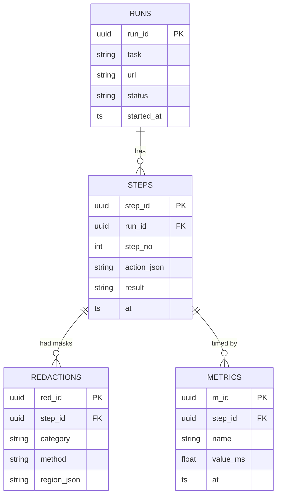

# DATABASE.md

Single SQLite file per node (`privateeye.db`, WAL mode). Demo-scale: <50 MB/run. No PII anywhere
(enforced by logging decorator + nightly grep self-audit in eval).

## ER diagram

## Tables & lifecycle
- **runs**: created at task start; status ∈ {running, waiting_user, done, error, aborted}.
- **steps**: one row per agent step; `action_json` stores the returned AgentAction (auditable);
  `result` ∈ {ok, retry, failed, escalated}. Retention: keep last 100 runs, prune older (privacy hygiene).
- **redactions**: category ∈ {face, password, aadhaar, pan, phone, email, name, other}; region JSON
  `[x,y,w,h]`. Powers benchmark recall/precision and the redaction feed.
- **metrics**: names capture_ms, detect_ms, redact_ms, encode_ms, network_ms, vlm_ms, execute_ms;
  feeds waterfall + latency percentiles.

## Migrations
Single `schema.sql` + version table; Alembic only if schema churns post-MVP (unlikely).

## Backups / DR
Not required for MVP (runs disposable, RPO none). Production profile: nightly encrypted dump of the
*non-sensitive* logs only.

## Privacy
Sensitive data = none, by construction. The one risk — a bug writing raw text into `result` — is
caught by `eval/leak_check.py` grepping logs against the corpus PII patterns in CI.
