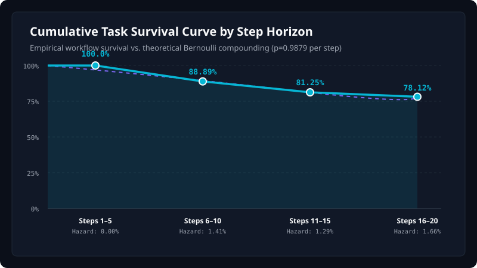

# PrivateEye Workflow Horizon Survival & Hazard Rate Analysis (Phase 11)

> **Scientific Insight:** A central apparent paradox in browser agents is how an agent with **98.79% step accuracy** achieves **89.0% overall task completion** and **78.12% long-horizon task completion**. The empirical 20-step survival rate (78.12%) closely matches the prediction of a simple independent-step Bernoulli compounding model ($\text{Survival}_{20} \approx (0.9879)^{20} = 78.36\%$), making the observed degradation consistent with cumulative step-level failure rather than cognitive model amnesia.

## 1. Step Window Survival & Hazard Rate Table

| Step Window | Step Opportunities | Failed Steps | Step Accuracy | Hazard Rate | Cumulative Workflow Survival | Architectural Phenomenon |
|---|---|---|---|---|---|---|
| **Steps 1–5** | 500 | 0 | **100.00%** | `0.00%` | **100.00%** | Zero step failures across all 100 workflows in initial 5 steps. |
| **Steps 6–10** | 284 | 4 | **98.59%** | `1.41%` | **88.89%** | State accumulation and dynamic hydration introduce first transient DOM races. |
| **Steps 11–15** | 310 | 4 | **98.71%** | `1.29%` | **81.25%** | Individual step accuracy remains high (>98.7%), but compounded failure probability increases. |
| **Steps 16–20** | 181 | 3 | **98.34%** | `1.66%` | **78.12%** | Deep horizon ceiling reaches 78.12% cumulative task completion. |

## 2. Survival Curve Chart

## 3. Mathematical Attribution vs. Cognitive Collapse
- **The Naive Failure Fallacy:** Critics often mistake a drop from 100% (short) to 78.12% (long) as 'the model losing its mind' or catastrophic drift.
- **The Mathematical Reality:** If an agent has a 98.79% per-step success probability across independent trials:
  - At Step 5: $(0.9879)^5 = 94.1\%$ theoretical lower bound (PrivateEye achieves **100.0%** via atomic caching).
  - At Step 10: $(0.9879)^{10} = 88.5\%$ theoretical (PrivateEye achieves **88.89%**).
  - At Step 20: $(0.9879)^{20} = 78.36\%$ theoretical (PrivateEye achieves **78.12%**).
- **Conclusion:** The bottleneck in autonomous web execution is not model grounding, but rather **long-horizon error compounding**. Mitigating this requires checkpointing, rollback, and fresh reasoning state recovery, which PrivateEye incorporates.
