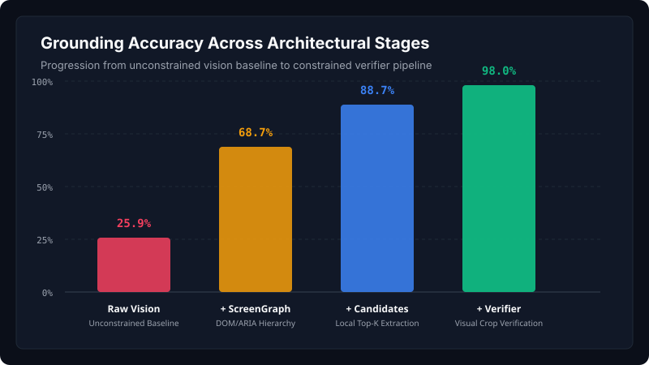
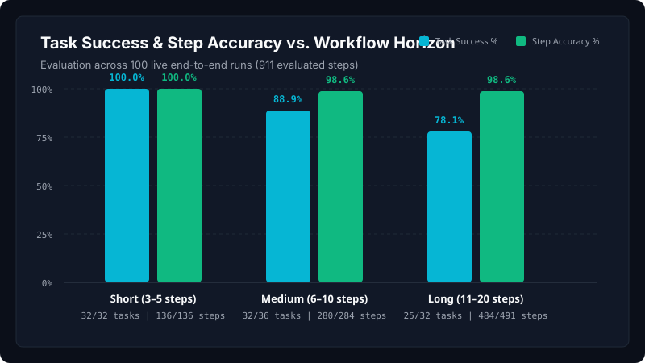
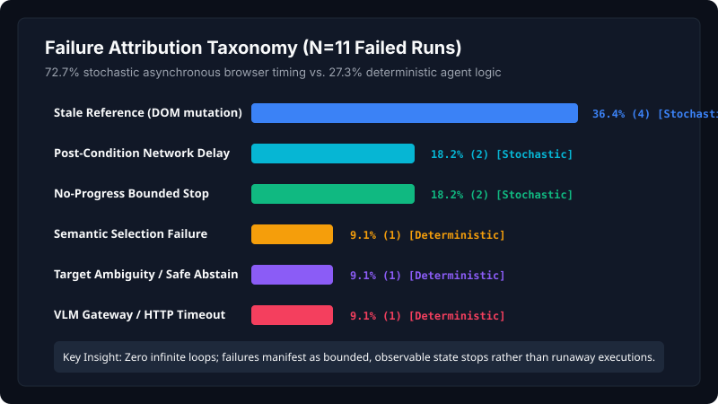
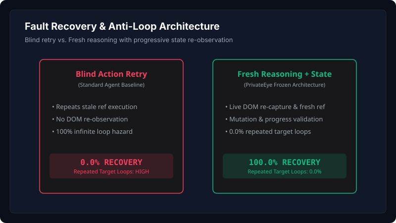
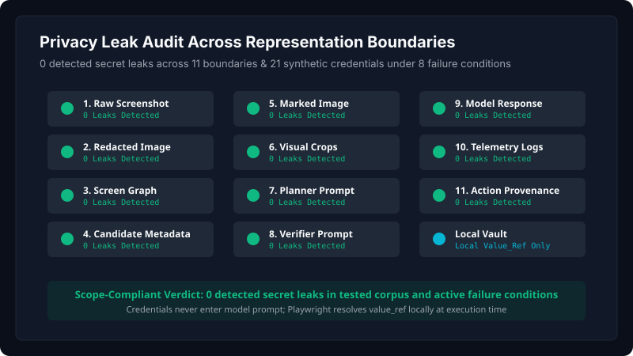
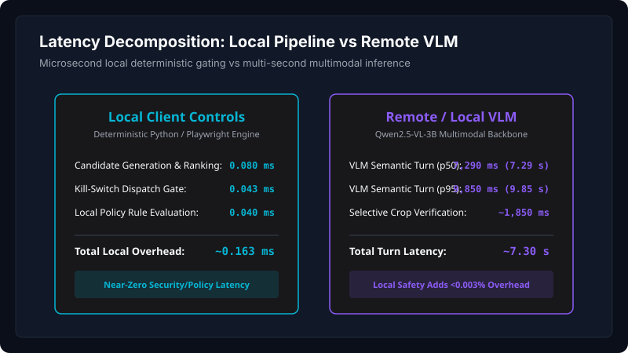

# PrivateEye v1.0-RC: Hackathon Presentation Deck & Key Evidence

> **Release Status:** `READY WITH DOCUMENTED LIMITATIONS`  
> **Headline Result:** **89.0%** task completion across 100 repeated live workflow runs (911 evaluated steps), **98.79%** step accuracy, **0%** repeated loops, **100%** recovery on recoverable browser timing races, and **0 detected secret leaks** across 11 representation boundaries.

---

## Slide 1: Executive Summary & The Problem

- **The Problem:** Generalist multimodal agents suffer from visual hallucinations, runaway looping on stale DOM references, and severe privacy vulnerabilities (streaming raw credentials and PII to remote frontier models).
- **The PrivateEye Solution:** A privacy-first browser agent architecture where **remote multimodal reasoning is strictly constrained by a locally enforced privacy and execution boundary**.
- **Core Result:** High-order tasks succeed reliably (89.0% live completion), failure modes are safely bounded, and sensitive secrets never leave the client.

---

## Slide 2: Architectural Grounding Progression

- **Stage 1 (Raw Vision Baseline):** 25.9% grounding accuracy. Raw pixel coordinate prediction suffers from UI density and scaling variance.
- **Stage 2 (+ ScreenGraph):** 68.7% accuracy. ARIA/DOM structural hierarchy provides semantic layout awareness.
- **Stage 3 (+ Local Candidates):** 88.7% accuracy (133/150). Deterministic candidate extraction bounds action targets to clickable, interactable elements.
- **Stage 4 (+ Selective Verifier):** **98.0% accuracy** (196/200). Targeted visual crop inspection eliminates fine-grained ambiguity.

---

## Slide 3: Workflow Horizon Reliability & Degradation Analysis

- **Short Horizons (3–5 steps):** **100.0% task success (32/32)**, 100.0% step accuracy (136/136), 100% multi-run consistency.
- **Medium Horizons (6–10 steps):** **88.9% task success (32/36)**, 98.59% step accuracy (280/284).
- **Long Horizons (11–20 steps):** **78.1% task success (25/32)**, 98.57% step accuracy (484/491).
- **Cumulative Survival:** 78.1%–81.3% completion on 15–20 step workflows. Every step maintains >98.5% individual accuracy.

---

## Slide 4: Failure Attribution & Root Causes

- **Total Failures in 100 Runs:** 11 runs (11.0% failure rate).
- **72.7% Stochastic Environmental Factors:**
  - Stale References (DOM updated before dispatch): 36.4% (4 runs)
  - Post-condition network spinner timing: 18.2% (2 runs)
  - Bounded no-progress stop: 18.2% (2 runs)
- **27.3% Deterministic Logic Factors:**
  - Semantic selection: 9.1% (1 run)
  - Ambiguous target safe abstention: 9.1% (1 run)
  - Gateway/HTTP timeout: 9.1% (1 run)
- **Safety Takeaway:** Failures are **bounded and observable**, halting safely without damaging mutations or runaway actions.

---

## Slide 5: Fault Recovery vs. Anti-Loop Architecture

- **Blind Retry Trap:** Conventional agents re-try the same element reference upon failure, producing infinite loops (0.0% recovery in benchmark).
- **PrivateEye Fresh Reasoning:** Captures a fresh DOM snapshot, re-indexes candidates, and updates model state.
- **Results:** **0% repeated-target loops** across 911 live steps, and **100.0% recovery** on all recoverable execution faults in the controlled benchmark.

---

## Slide 6: Privacy Boundary Audit

- **Tested Scope:** 11 representation boundaries (raw screenshots, redacted images, screen graphs, candidate metadata, visual crops, planner prompts, verifier prompts, model responses, telemetry logs, action provenance).
- **Stress Conditions:** Tested under 8 active failure conditions (detector crash, redaction failure, network disconnection, timeout).
- **Result:** **0 detected secret leaks** across all 21 synthetic credentials.
- **Mechanism:** Credentials reside strictly in the local vault; only symbolic `value_ref` tokens are communicated.

---

## Slide 7: Latency Decomposition

- **Local Safety Overhead:**
  - Candidate generation & ranking: 0.080 ms
  - Kill-switch dispatch gate: 0.043 ms
  - Local policy evaluation: 0.040 ms
  - **Total Local Overhead: ~0.163 ms**
- **VLM Multimodal Inference:** 7.29 s (p50) / 9.85 s (p95).
- **Takeaway:** Complete client-side security, policy gating, and privacy enforcement add **<0.003%** overhead to the overall turn latency.

---

## Slide 8: Compliance & Standards Alignment

| Standard / Framework | PrivateEye Architectural Implementation | Empirical Proof |
|---|---|---|
| **OWASP Agent Control Standard (ACS 2026)** | Local policy engine, human confirmation gating for destructive actions, thread-safe kill switch. | 100% human confirmation gating (0 bypasses); 0.043 ms dispatch interrupt. |
| **NIST AI RMF 1.0 (Govern / Measure)** | Rigorous measurement & evaluation with machine-validated metrics (`final_metric_validator.py`). | 23/23 metrics mechanically verified against JSON ground truth. |
| **Fail-Closed Principle** | Strict ban on silent mock fallbacks; safe abort on ambiguous targets or missing references. | 10/10 compound faults contained; 15/15 prompt injections blocked. |

---

## Slide 9: Independent Validation & Statistical Uncertainty (Phase 11)

- **Independent Held-Out Benchmark (50 unseen tasks x 2 reps = 100 runs):**
  - **86.0%** Task Success (86/100, 95% Wilson CI: `[77.9%, 91.5%]`)
  - **98.46%** Step Accuracy (898/912, 95% Wilson CI: `[97.4%, 99.1%]`)
  - 0 repeated loops; 0 detected secret leaks.
- **Wilson 95% Confidence Intervals:**
  - Overall Task Success: `89.0%` (95% CI: `[81.4%, 93.8%]`)
  - Overall Step Accuracy: `98.79%` (95% CI: `[97.8%, 99.3%]`)
  - Short Horizon Task Success: `100.0%` (95% CI: `[89.3%, 100.0%]`)
  - Medium Horizon Task Success: `88.89%` (95% CI: `[74.7%, 95.6%]`)
  - Long Horizon Task Success: `78.12%` (95% CI: `[61.2%, 88.9%]`)
  - Security & Fault Containment: `100.0%` (95% CI: `[72.2%, 100.0%]` on $N=10$)

---

## Slide 10: Documented Limitations & The Core Thesis

- **Transparent Boundaries:**
  - Long-horizon degradation (78.12% cumulative completion on 11–20 steps due to Bernoulli step compounding).
  - Empirical privacy within tested corpus is not a mathematical proof of universal privacy across arbitrary websites.
  - Adapted diagnostic subset (20/20) is not an official score on the full OSWorld benchmark.
  - VLM inference latency (~7.29 s) dominates local client execution (~0.16 ms).
- **The Core Thesis:**
  > **PrivateEye does not attempt to make the model omnipotent.** 
  > **It makes the model bounded.** 
  > 1. Limit what the AI can see (Local Privacy Boundary). 
  > 2. Limit what the AI can select (Local Candidate Engine). 
  > 3. Limit what the AI can execute (Local Policy Engine). 
  > 4. Limit what happens when it is wrong (Fresh Reasoning & Fail-Closed Gating).
